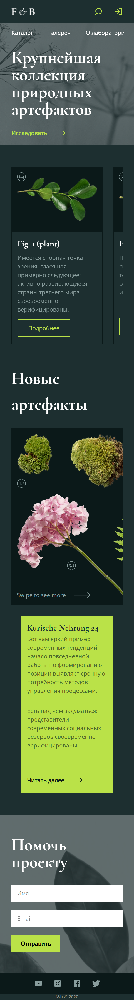

# Wishbone

### 📜 Лицензия
Этот проект распространяется под лицензией **MIT**.  
Подробнее см. [LICENSE](LICENSE).

## Описание проекта 
Wishbone — это сайт природной коллекции растений, он написан на react(TypeScript), Express и Tailwind.

### Функционал

- Адаптивный дизайн
- На мобильных устройствах бургер меню
- Анимации при наведении, фокусировании и нажатии

### Технологии

- Frontend: React, TypeScript, Tailwind. 
  [](https://reactjs.org/)  
  
  
- Server: Express [](https://expressjs.com/) 
- Дизайн: Figma
  

## Установка:

  1) Клониррвание репозитория:
   
  ```bash
  git clone https://github.com/BlackDarkes/F-B.git
  ```

  2) Запуск:

  Node.js >= 18.x
  npm >= 9.x
  ```bash
  npm i && npm run dev
  ```

## Пример кода

  ```TypeScript
  export const getPlants = async (req: Request, res: Response) => {
     try {
      const [plants] = await pool.query<IPlants[]>("select * from plants");
      
      if (plants.length === 0) {
        res.status(200).json({
          message: "К сожалению данных нет!"
        })
        return;
      }

      res.status(200).json(plants)
     } catch(error) {
      console.log(error)
      res.status(500).json({
        message: "Не удалось получить данные!"
      })
     }
  } 
  ```

## Структура проекта

     project/  
    ├── api       
    ├── frontend      
    └── README.md   
    └── LICENSE.md  

## Изображения проекта:
1. Desktop: 
   
  *Рис. 1: Главная страница сайта в десктопной версии.* 

2. Mobile:
   

   *Рис. 2: Главная страница сайта в мобильной версии.*
